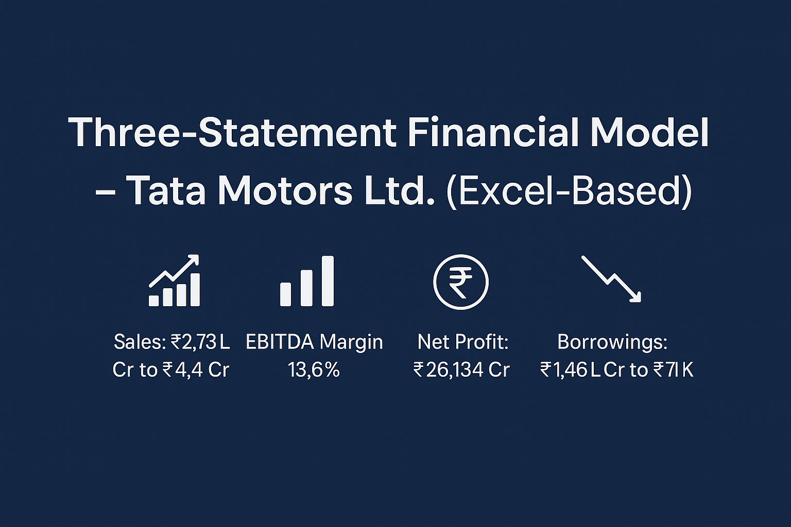

  

# 📊 Tata Motors – 3 Statement Financial Analysis (TAMO)

This project presents a detailed **Three-Statement Financial Analysis** of **Tata Motors (TAMO)** using tools like Microsoft Excel and Power BI, created by **Sagar Somaiya**.

🔗 **LinkedIn Post (Full Walkthrough)**:  
[Click here to view](https://www.linkedin.com/posts/sagar-somaiya_three-statement-financial-model-tata-motors-activity-7332337391732424705-T6g8)

---

## 📁 What's Included in This Repo?

- `TAMO.xlsx` – Excel-based Financial Statement Analysis
- `TAMO.png` – Project cover image/banner
- `README.md` – Project overview and explanation

---

## 🔍 Analysis Covers:

✅ **Balance Sheet** – Year-on-year comparison and trend  
✅ **Profit & Loss Statement** – Ratio analysis, revenue breakdown  
✅ **Cash Flow Statement** – Inflow/outflow tracking  

---

## 🛠️ Tools & Skills Used

- **Microsoft Excel**: Pivot Tables, Charts, Formula-based modeling    
- **Power Query**: Data cleaning and transformation  
- **Financial Analysis**: Ratio interpretation and forecasting techniques  

---

## 📌 Objective

To create a structured 3-statement financial model that helps understand **Tata Motors’ financial health**, analyze trends, and support **data-driven decision making**.

---

## 👨‍💼 Author

**Sagar Somaiya**  
Accounting & Finance Professional | Excel & Power BI Analyst | Aspiring Data Analyst  
🔗 [LinkedIn](https://www.linkedin.com/in/sagar-somaiya)

---

## ⭐ Support & Feedback

If you found this project useful:
- ⭐ Star the repo
- 🔁 Share it with your network
- 💬 Connect on [LinkedIn](https://www.linkedin.com/in/sagar-somaiya)

> Let’s make finance more data-driven and visual! 📈
